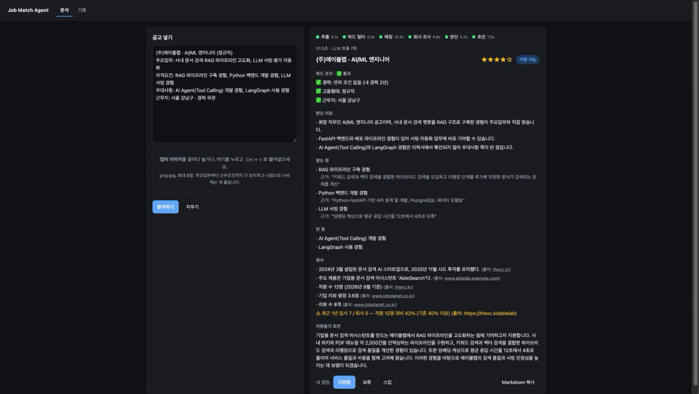

# job-match-agent — 채용공고 매칭 Agent

[](https://github.com/alyxa1008/job-match-agent/actions/workflows/tests.yml)

채용공고 텍스트나 캡처 이미지를 넣으면, 내 이력서·기준과 대조해 **지원 여부를 판단하고 근거·회사 정보·지원동기 초안까지 만들어 주는 개인용 AI Agent**입니다.

> **상태: 기능 구현 완료(M0~M5), 평가(M6) 예정.** 브라우저에서 공고를 넣어 리포트를 받고 결정을 기록하는 데까지 동작합니다. 라벨 대비 판단 일치율 같은 수치는 평가 세트를 채운 뒤 [진행 상황](#진행-상황)의 M6에서 기록합니다. 설계 과정에서 겪은 문제와 선택은 [설계 결정과 배운 점](#설계-결정과-배운-점)에, 현재 한계는 [알려진 한계](#알려진-한계)에 적어 두었습니다.



## 왜 만들었나

공고 하나를 판단하는 데 10분 이상 걸립니다. 자격요건을 이력서와 대조하고, 경력 조건을 확인하고, 회사를 조사해야 하기 때문입니다. 게다가 판단 기준이 그날그날 흔들립니다. 이 과정을 20초 안팎으로, 매번 같은 기준으로 처리하는 것이 목표입니다.

## 동작 흐름

```
입력: 공고 텍스트 및/또는 캡처 이미지(jpg·png)
  │
  ▼
[extract]   LLM 구조화 출력(이미지는 멀티모달 입력) → JobPosting(JSON)
  │
  ▼
[filters]   순수 파이썬 규칙 → HardFilterResult (PASS / WARN / FAIL)
  │
  ├─ FAIL → [report] 로 바로 이동 (회사 조사·매칭 생략: 호출·시간 절약)
  │
  ▼ PASS / WARN
[match] ─┐  병렬 실행
[research]┘  research는 web_search / fetch_page 도구를 고르는 Tool Calling 루프
  │
  ▼
[judge]     종합 → 추천도(1~5), 결론, 맞는 점/빈 점/걸리는 점
  │
  ├─ 추천도 ≥ 3 → [draft] 지원동기 초안
  ▼
[report]    Markdown 리포트 + DB 저장
```

리포트 예시(가상의 회사):

```
(주)에이블랩 · AI/ML 엔지니어
추천도 ★★★★★ → 지원 추천

[하드 조건] ✅ 통과
 · 경력: 연차 조건 없음 (내 경력 2년 3개월)
 · 고용형태: 정규직

[맞는 점]
 · RAG 파이프라인(chunking·retriever·reranker·평가)
   근거: "하이브리드 검색을 도입해 ... 개선"   ← 이력서 원문 인용
[빈 점]
 · AI Agent 실무 경험 없음
[회사]
 · 2024년 설립, 약 10명, 시드  (출처: URL)
[지원동기 초안]  (추천도 ★★★ 이상일 때만 생성)
```

## 설계 원칙

1. **숫자·규칙 판정은 LLM이 아니라 코드가 한다.** 경력 연차 비교, 고용형태, 키워드 경고는 순수 함수(`filters.py`)로 처리하고 pytest로 검증합니다. LLM은 공고에서 값을 추출만 합니다.
2. **모든 "맞는 점"에는 이력서 원문 인용을 근거로 단다.** 인용이 이력서에 실제로 있는지 코드로 확인하고, 없으면 그 항목을 버립니다(환각 방지). 빈 점과 필수요건 충족 비율도 모델이 아니라 코드가 계산합니다.
3. **회사 정보는 반드시 출처 URL과 함께.** 도구 결과에 실제로 나온 URL만 출처로 인정하고, 찾지 못하면 "정보 없음"이라고 씁니다. 추측으로 채우지 않습니다. 출처는 등급을 나눠(기업 데이터·채용 플랫폼 > 언론 > 블로그·자동 집계) 블로그·집계 사이트의 숫자는 버리고, 같은 수치가 출처마다 다르면 그 사실을 경고로 표시합니다. 평점·퇴사 비율 경고는 숫자(출처 포함)를 받아 코드가 `profile.yaml`의 기준으로 판정합니다.
4. **Agent다운 분기.** 하드 조건 FAIL이면 조사를 생략하고, 회사명이 흔해 검색 결과가 어긋나면 업종 키워드를 붙여 재검색하며, 추천도가 낮으면 초안을 만들지 않습니다.
5. **모델 교체 가능.** LLM 호출은 `agent/llm.py` 한 곳에서만 하고, 모델명·엔드포인트는 환경변수로 둡니다.
6. **이력서는 RAG 없이 통째로 컨텍스트에 넣는다.** 5쪽 분량이라 검색 단계를 둘 이유가 없습니다.

## 기술 스택

| 역할 | 선택 |
|---|---|
| 언어 | Python 3.11+ |
| LLM | Google Gemini Flash (OpenAI 호환 엔드포인트, `openai` SDK) |
| 구조화 출력 | Pydantic 검증 + 실패 시 오류를 모델에 되돌려 1회 재시도 |
| Agent | 전체 흐름은 LangGraph(조건 분기·병렬 실행), 회사 조사는 직접 구현한 Tool Calling 루프 |
| 검색 | DuckDuckGo 검색 + 본문 추출 |
| 저장 | SQLite |
| 화면 | FastAPI + 정적 HTML/CSS/JS (로컬 전용, 진행 단계를 NDJSON 스트림으로 실시간 표시) |
| 테스트 | pytest 101개 — 가짜 모델·가짜 도구로 돌아 API 키 없이 실행, GitHub Actions에서 Python 3.11·3.13 자동 실행 |

## 실행 방법

```bash
python3 -m venv .venv
.venv/bin/pip install -r requirements.txt

cp .env.example .env                          # LLM_API_KEY 입력 (Google AI Studio 무료 키)
cp config/profile.example.yaml config/profile.yaml
cp data/resume.example.md data/resume.md      # 자기 이력서로 교체

.venv/bin/python app.py                                   # 웹 화면: http://127.0.0.1:8000 (내 컴퓨터에서만 접속)
.venv/bin/python -m agent.graph 공고.png                   # 터미널에서 전체 분석 → Markdown 리포트
.venv/bin/python -m agent.graph 공고1.png 공고2.png 메모.txt     # 캡처 여러 장 + 텍스트
.venv/bin/python -m agent.extract 공고.png                 # 추출 단계만 (JobPosting JSON)
.venv/bin/python -m pytest                                # 테스트 (LLM 호출 없음)
```

웹 화면에서는 공고 텍스트를 붙여넣거나 캡처(png·jpg, 최대 6장)를 올리면 추출 → 하드 필터 → 매칭·회사 조사 → 판단 → 초안 단계가 실시간으로 표시되고, 리포트 아래 [지원함] [보류] [스킵]으로 결정을 기록합니다. 기록 탭에서 지난 분석을 다시 볼 수 있습니다. 결과는 `data/app.db`(SQLite)에 남습니다.

무료 API 한도는 모델별로 따로 계산됩니다. `.env`에서 노드별 모델(`LLM_MODEL_EXTRACT` 등)을 나눠 지정할 수 있고, `LLM_CACHE=1`이면 LLM 응답과 검색 결과를 저장해 두었다가 같은 공고를 다시 분석할 때 호출 없이 그대로 재생합니다(개발·평가 중 한도 절약, 결과 재현).

### 병렬 실행 효과 (실측 1건)

같은 실행 안에서 노드별 소요 시간의 합과 실제 걸린 시간을 비교한 값입니다. 매칭(16.9초)과 회사 조사(15.4초)가 동시에 돌아 조사 시간만큼 줄었습니다.

| | 시간 |
|---|---|
| 노드 소요 시간 합계 (순차로 돌렸을 때) | 63.7초 |
| 실제 소요 (매칭·회사 조사 병렬) | 48.3초 |
| LLM 호출 | 8회 (추출 1, 매칭 1, 조사 4, 판단 1, 초안 1) |

무료 등급 모델의 응답 속도에 크게 좌우되며, 목표(20초 안팎)에는 아직 못 미칩니다.

## 진행 상황

| 단계 | 내용 | 상태 |
|---|---|---|
| M0 | 저장소 뼈대, LLM 호출 단일 진입점(`llm.py`: 429·503 재시도, 노드별 모델 지정, 시간·토큰 로깅, 개발용 응답 캐시) | 완료 |
| M1 | 데이터 구조(`schemas.py`), 공고 추출(`extract.py`: 텍스트·이미지 입력) | 완료 |
| M2 | 하드 필터(`filters.py`), 경력 계산(`profile.py`), 단위 테스트 25개 | 완료 |
| M3 | 매칭(`match.py`: 인용 검증), 회사 조사(`research.py`·`tools.py`: Tool Calling 루프, 출처 검증), 판단·초안(`judge.py`), 리포트(`report.py`), 전체 흐름(`graph.py`) | 완료 |
| M4 | LangGraph 이전(`graph.py`): 하드 조건 FAIL 시 조기 종료, 매칭·회사 조사 병렬, 추천도에 따른 초안 분기, 회사 조사 실패 시에도 리포트 완성 | 완료 |
| M5 | SQLite 저장(`store.py`) + FastAPI(`app.py`) + 웹 화면(`web/`): 텍스트·캡처 입력, 진행 단계 실시간 표시, 리포트, 결정 버튼, 기록 탭 | 완료 |
| M6 | 평가 스크립트: 직접 판단한 공고 라벨 대비 판단 일치율, 하드 필터 정확도, 평균 응답 시간·LLM 호출 수 | 예정 |

## 설계 결정과 배운 점

**LLM이 낸 것은 코드가 검증한다.** 처음부터 원칙으로 뒀지만, 실제로 걸러낸 사례를 보고 확신이 생겼습니다. 매칭 단계에서 모델이 이력서의 두 문장을 이어 붙여 만든 인용을 "이력서에 없음"으로 버린 일이 있었고, 회사 조사에서는 모델이 적은 출처 URL이 검색 결과에 없는 경우가 나왔습니다. 그래서 모델에게는 "고르는 일"만 시킵니다. 매칭은 공고 항목 번호와 인용만, 판단은 추천도와 빈 점의 번호만, 회사 조사는 사실·수치와 출처 URL만 내게 하고, 인용 존재·출처 존재·결론 문구·충족 비율·경고는 전부 코드가 정합니다.

**이력서에 RAG를 쓰지 않았다.** 이력서는 5쪽, 토큰으로 수천 개라 매칭·판단 호출에 통째로 넣어도 비용과 품질 모두 문제가 없습니다. 검색 단계를 두면 "이 항목의 근거가 검색에서 빠졌다"는 새 실패 지점이 생깁니다. 필요 없는 구성 요소는 넣지 않는 쪽을 택했습니다.

**무료 한도가 설계를 바꿨다.** Gemini 무료 등급은 모델별로 분당 5회, 하루 20회였습니다(직접 측정). 개발 첫날 테스트만으로 한 모델의 하루치를 다 썼습니다. 대응으로 세 가지를 넣었습니다. ① 노드별 모델 분리(`LLM_MODEL_<NODE>`) — 한도가 모델별이라 나눠 쓰면 하루 사용량이 늘어납니다. ② 재생 캐시 — LLM 응답만 캐시했더니 검색 결과가 실행마다 달라져 뒤의 호출이 전부 빗나갔고, 검색 결과까지 캐시하고서야 같은 공고의 재실행이 호출 0회로 재현됐습니다. ③ 429 응답에 담긴 재시도 시간을 읽어 분당 한도는 기다리고 일일 한도는 바로 안내합니다. 회사 조사 호출 상한도 6회에서 4회로 줄여 공고 1건을 8회 안에 끝냅니다.

**회사 정보는 출처마다 다르다.** 같은 회사를 두 번 조사했는데 한 번은 "누적 투자 120억·직원 25명", 다른 한 번은 "약 50억·9명"이 나왔고, 뒤의 숫자를 근거로 "소규모 회사" 경고까지 붙었습니다. 출처가 자동 집계 사이트였습니다. 이 일을 계기로 출처 등급(기업 데이터·채용 플랫폼 > 언론 > 블로그·집계)을 코드로 두고, 낮은 등급의 숫자는 버리며, 값이 다른 출처가 있으면 그 사실 자체를 경고로 표시하도록 바꿨습니다. 모델이 자유롭게 쓰던 경고는 없애고, 평점·퇴사 비율 경고는 숫자를 받아 `profile.yaml`의 기준으로 코드가 판정합니다.

**속도 목표(20초)는 아직 못 맞췄다.** 실측 48초 중 대부분이 모델 응답 시간입니다(추출 12초, 매칭 17초, 판단 8초, 초안 11초). LangGraph로 매칭과 회사 조사를 병렬로 돌려 15초를 줄였지만, 나머지는 모델 선택과 프롬프트 길이의 문제라 유료 등급이나 더 빠른 모델 없이는 한계가 있습니다.

**서버로 띄우기 전에 상태를 전역에서 뺐다.** 터미널 실행에서는 문제가 없던 전역 호출 기록이, FastAPI로 상주시키면 요청마다 쌓이고 동시 요청끼리 섞입니다. 분석 1건 단위로 모았다 버리는 구조(`llm.track_calls()`)로 바꾸고, 병렬 노드가 다른 스레드에서 돌아도 같은 묶음에 기록되는지 테스트로 고정했습니다. 웹페이지 가져오기도 크기 제한 없이 받던 것을 2MB 스트리밍으로 바꿨습니다.

## 알려진 한계

- **캡처 인식 오류.** 가벼운 모델은 회사명을 한 글자 다르게 읽은 적이 있습니다(한 건). 회사명이 틀리면 회사 조사가 엉뚱한 회사를 찾습니다. 리포트의 회사명을 한 번 확인하는 것이 안전합니다.
- **회사 정보의 깊이와 정확성.** 검색 스니펫 위주라 정보가 얇고, 출처 URL이 실제로 그 문장을 담고 있는지까지는 코드가 확인하지 않습니다(URL이 도구 결과에 나왔는지만 확인). 평점·인원 같은 수치는 출처 사이트의 시점에 따라 다를 수 있습니다.
- **응답 시간.** 30~50초로 목표(20초)에 못 미칩니다.
- **빈 점 목록의 잡음.** "경력 무관" 같은 조건 안내나 성향 항목도 빈 점 후보에 들어가며, 판단 단계가 걸러내지만 완벽하지 않습니다.
- **평가 수치 없음.** 라벨 14건 중 공고 원문이 3건뿐이라 판단 일치율을 아직 재지 못했습니다. M6에서 채웁니다.
- **단일 사용자 전제.** 로그인·권한·동시 사용자 격리가 없고, 저장은 SQLite 파일 하나입니다. 운영 환경이라면 호출별 프롬프트·응답 추적, 프롬프트 버전 관리, 자동 회귀 평가가 더 필요합니다.

## 개인 데이터

이력서(`data/resume.md`), 판단 기준(`config/profile.yaml`), 평가 라벨과 공고 원문(`eval/labels.csv`, `eval/cases/`)은 저장소에 올리지 않습니다. 형식은 각 위치의 `*.example` 파일로 확인할 수 있습니다. 채용 사이트를 크롤링하지 않으며, 공고는 사용자가 직접 넣은 텍스트·캡처만 사용합니다.
